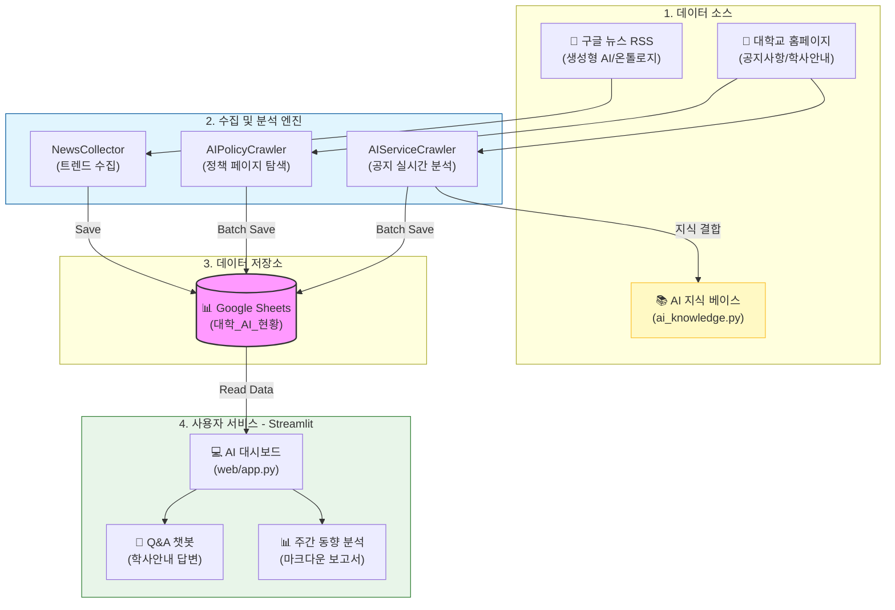

# 🏗️ AI University Monitor 시스템 구성도

본 프로젝트의 데이터 흐름과 서비스 구조를 정의한 문서입니다.

## 1. 시스템 아키텍처 (Mermaid)

## 2. 레이어별 상세 역할

### 📋 1. Data Layer (데이터 소스)
*   **University Web:** 각 대학의 실시간 공지사항 및 학사 안내 페이지.
*   **Global News:** Google News RSS를 통한 생성형 AI 및 온톨로지 관련 최신 뉴스.
*   **AI Knowledge:** 젠스파크 등으로 미리 조사된 정적 지식 베이스 데이터.

### ⚙️ 2. Logic Layer (수집 및 분석)
*   **Selenium/Requests:** 웹 페이지를 읽고 필요한 정보를 파싱합니다.
*   **Heuristic Matching:** 키워드 기반으로 뉴스와 공지사항을 카테고리화합니다.
*   **Knowledge Enrichment:** 크롤링된 결과에 지식 베이스 정보를 병합하여 정확도를 높입니다.

### 🗄️ 3. Persistence Layer (저장소)
*   **Google Sheets API:** 중앙 집중식 데이터베이스 역할을 수행하며, 누구나 협업 및 수정이 가능합니다.

### 🖥️ 4. Presentation Layer (사용자 UI)
*   **Streamlit Framework:** 파이썬 기반의 웹 인터페이스를 제공합니다.
*   **Starbucks Premium Theme:** 사용자 친화적인 스타벅스 그린 컬러 테마 적용.
*   **Weekly Report Generator:** 수집된 데이터를 마크다운 형식의 주간 보고서로 자동 생성합니다.
